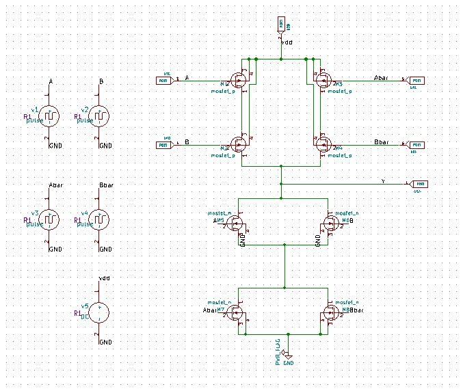

# XNOR Gate Design Using Static CMOS Logic

The aim of this project was to design static CMOS xnor logic gate using  eSim and SkyWater SKY130 PDK.
The design is simulated using ngspice 36.


## Contents

 - [Introduction](https://awesomeopensource.com/project/elangosundar/awesome-README-templates)
 - [Literature Review](https://github.com/matiassingers/awesome-readme)
 - [How to write a Good readme](https://bulldogjob.com/news/449-how-to-write-a-good-readme-for-your-github-project)


## Introduction

XNOR gate is an important logic gate in digital electronics. It is used in error detection circuit as even or odd parity checker and encoding operation in digital communication.  It is also used for bit manipulations in ALU. The static CMOS logic comprises of pull-up network (PUN) and pull-down network (PDN) are used to design any digital logic circuit in CMOS. This project presents the design of XNOR gate using static CMOS logic.
## Circuit Design

Exclusive-NOR gate (XNOR) output will be high when, even number of its inputs are high or all the inputs are low, else output will be low for other cases. The truth table for two input XNOR gate is given below.
### Truth Table

| A | B | Y |
| -------------- | --------------- | --------------- |
| 0 | 0 | 1 |
| 0 | 1 | 0 |
| 1 | 0 | 0 |
| 1 | 1 | 1 |

### Equations

In static CMOS logic pull-up network consists of pmos and pull-down network consists of nmos. Depending upon which network is activated, it drives the output to high or low respectively. Boolean equation for XNOR gate is given below.

Y = A⨀B = A'B' + AB

Since static CMOS logic produce active low, double complement the above equation and simplify the equation using De Morgan’s theorem.

Y={A'B' + AB}''

Y={(A + B).(A' + B')}'

This equation was used to design the circuit.

### Circuit Design in eSim Tool



### Spice File

```bash
* C:\eSimProjects\Xnor\Xnor.cir
.lib "sky130_fd_pr/models/sky130.lib.spice" tt

* PUN Circuit
xM1  Net-_M1-Pad1_ A vdd vdd sky130_fd_pr__pfet_01v8 W=2.5 L=0.5 M=1
xM2  Y B Net-_M1-Pad1_ vdd sky130_fd_pr__pfet_01v8 W=2.5 L=0.5 M=1
xM3  Net-_M3-Pad1_ Abar vdd vdd sky130_fd_pr__pfet_01v8 W=2.5 L=0.5 M=1
xM4  Y Bbar Net-_M3-Pad1_ vdd sky130_fd_pr__pfet_01v8 W=2.5 L=0.5 M=1

* PDN Circuit
xM5  Y A Net-_M5-Pad3_ GND sky130_fd_pr__nfet_01v8 W=1 L=0.5 M=1
xM7  Net-_M5-Pad3_ Abar GND GND sky130_fd_pr__nfet_01v8 W=1 L=0.5 M=1
xM6  Y B Net-_M5-Pad3_ GND sky130_fd_pr__nfet_01v8 W=1 L=0.5 M=1
xM8  Net-_M5-Pad3_ Bbar GND GND sky130_fd_pr__nfet_01v8 W=1 L=0.5 M=1

* Biasing		
v1  A GND pulse(0 1.8 0s 0s 0s 4us 8us)	
v2  B GND pulse(0 1.8 0s 0s 0s 2us 4us)			
v3  Abar GND pulse(1.8 0 0s 0s 0s 4us 8us)			
v4  Bbar GND pulse(1.8 0 0s 0s 0s 2us 4us)			
v5  vdd GND DC 1.8

.tran 0.1us 8us

* Control Statements
.control
run

plot v(A)+20 v(B)+15 v(Abar)+10 v(Bbar)+5 v(Y)+1
.endC

.end
```
