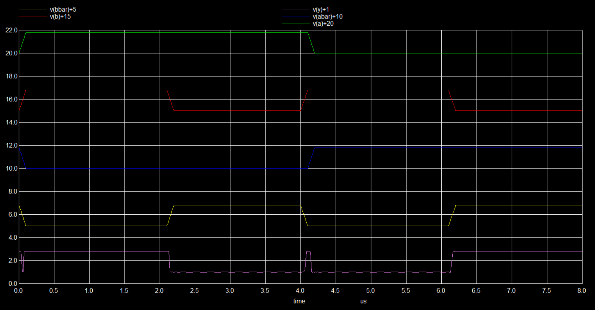

# XNOR Gate Design Using Static CMOS Logic

The aim of this project was to design static CMOS xnor logic gate using  eSim and SkyWater SKY130 PDK.
The design is simulated using ngspice 36.


## Contents

 - [Introduction](#Introduction)
 - [Tools](#Tools)
 - [Circuit Design](#Circuit-Design)
 - - [Truth Table](#Truth-Table)
 - - [Equations](#Equations)
 - - [Circuit Design in eSim Tool](#Circuit-Design-in-eSim-Tool)
 - - [Spice File](#Spice-File)
 - - [Waveform](#Waveform)
 - [Usage](#Usage)
 - [Conclusion](#Conclusion)
 - [References](#References)
 - [Acknowledgements](#Acknowledgements)


## Introduction

XNOR gate is an important logic gate in digital electronics. It is used in error detection circuit as even or odd parity checker and encoding operation in digital communication.  It is also used for bit manipulations in ALU. The static CMOS logic comprises of pull-up network (PUN) and pull-down network (PDN) are used to design any digital logic circuit in CMOS. This project presents the design of XNOR gate using static CMOS logic.


## Tools

**eSim:** It is a free/libre and open source EDA tool for circuit design, simulation, analysis and PCB design. 

**ngspice 36:** It is an open source spice simulator for electric and electronic circuits.

**SkyWater SKY 130 PDK:** It is an open source PDK for 130nm nodes.

## Circuit Design

Exclusive-NOR gate (XNOR) output will be high when, even number of its inputs are high or all the inputs are low, else output will be low for other cases. The truth table for two input XNOR gate is given below.
### Truth Table

| A | B | Y |
| -------------- | --------------- | --------------- |
| 0 | 0 | 1 |
| 0 | 1 | 0 |
| 1 | 0 | 0 |
| 1 | 1 | 1 |

### Equations

In static CMOS logic pull-up network consists of pmos and pull-down network consists of nmos. Depending upon which network is activated, it drives the output to high or low respectively. Boolean equation for XNOR gate is given below.

Y = A⨀B = A'B' + AB

Since static CMOS logic produce active low, double complement the above equation and simplify the equation using De Morgan’s theorem.

Y={A'B' + AB}''

Y={(A + B).(A' + B')}'

This equation was used to design the circuit.

### Circuit Design in eSim Tool


### Spice File

```bash
* C:\eSimProjects\Xnor\Xnor.cir
.lib "sky130_fd_pr/models/sky130.lib.spice" tt

* PUN Circuit
xM1  Net-_M1-Pad1_ A vdd vdd sky130_fd_pr__pfet_01v8 W=2.5 L=0.5 M=1
xM2  Y B Net-_M1-Pad1_ vdd sky130_fd_pr__pfet_01v8 W=2.5 L=0.5 M=1
xM3  Net-_M3-Pad1_ Abar vdd vdd sky130_fd_pr__pfet_01v8 W=2.5 L=0.5 M=1
xM4  Y Bbar Net-_M3-Pad1_ vdd sky130_fd_pr__pfet_01v8 W=2.5 L=0.5 M=1

* PDN Circuit
xM5  Y A Net-_M5-Pad3_ GND sky130_fd_pr__nfet_01v8 W=1 L=0.5 M=1
xM7  Net-_M5-Pad3_ Abar GND GND sky130_fd_pr__nfet_01v8 W=1 L=0.5 M=1
xM6  Y B Net-_M5-Pad3_ GND sky130_fd_pr__nfet_01v8 W=1 L=0.5 M=1
xM8  Net-_M5-Pad3_ Bbar GND GND sky130_fd_pr__nfet_01v8 W=1 L=0.5 M=1

* Power and signals		
v1  A GND pulse(0 1.8 0s 0s 0s 4us 8us)	
v2  B GND pulse(0 1.8 0s 0s 0s 2us 4us)			
v3  Abar GND pulse(1.8 0 0s 0s 0s 4us 8us)			
v4  Bbar GND pulse(1.8 0 0s 0s 0s 2us 4us)			
v5  vdd GND DC 1.8

.tran 0.1us 8us

* Control Statements
.control
run

plot v(A)+20 v(B)+15 v(Abar)+10 v(Bbar)+5 v(Y)+1
.endC

.end
```

The default nmos and pmos cell in eSim are replaced by sky130_fd_pr__nfet_1v8 and sky130_fd_pr__pfet_1v8 respectively. Pulse inputs are given to A, B, Abar and Bbar ports/pins. Port 'Y' is the output terminal of the XNOR circuit. The 1.8V DC given to Vdd port. The simulated waveform of XNOR circuit using ngspice 36 is shown below.

### Waveform



The port A and Abar pair makes one input, B and Bbar pair makes another input. The levels of the signals are shifted in spice circuit netlist for display of waves from all the ports on a single plot. All the input cases are simulated. 

## Usage

- Download and install the tools [esim](https://esim.fossee.in/download) and [ngspice 36](http://ngspice.sourceforge.net/download.html).

- Download the [SkyWater SKY130 PDK](https://static.fossee.in/esim/installation-files/sky130_fd_pr.zip) and unzip it.

- Download the Xnor folder from [here.](https://github.com/Knavere29/XNOR-Gate-Design-Using-Static-CMOS-Logic)

- Move the unziped PDK folder to your Xnor project folder.

- For waveform generation run the Xnor.cir file in ngspice 36.

## Conclusion 

The static CMOS logic XNOR gate was designed using eSim tool. The nfet and pfet cells of SkyWater SKY130 PDK was used in the circuit netlist. Finally, the netlist was simulated using ngspice 36 tool which generated waveform. The waveform was inspected with respect to the truth table and successfully verified.


## References

- [Aditi Joshi, Chanchal Jain, Pooja Choudhary, Chirag Arora and Krishan Rapswal, “ A Comparative Performance Analysis of Various CMOS Design Techniques for XOR and XNOR Circuits”, International Journal for Research in Applied Science & Engineering Technology (IJRASET), ISSN: 2321-9653, Volume 5 Issue IV, April 2017.](http://citeseerx.ist.psu.edu/viewdoc/download?doi=10.1.1.691.1319&rep=rep1&type=pdf) 
- [Adel S. Sedra and Kenneth C. Smith, "Microelectronic Circuits", Oxford University Press, Part III, Ch-Digital Intergraded Circuits, Page 1086-1156](https://www.amazon.in/Microelectronic-Circuits-Electrical-Computer-Engineering/dp/0199339139)
- [Kunal Ghosh, VSD - Circuit Design & SPICE Simulations - Part 1](https://www.udemy.com/course/vlsi-academy-circuit-design/)

## Acknowledgements

I'm extremely grateful to

- [Kunal Ghosh](https://github.com/kunalg123), Co-founder of VLSI System Design (VSD) Corp. Pvt. Ltd.
 - [SFAL](https://www.sfalcoe.com/) Hackathon Team, Karnataka.

## Author

- [Nagaraj V Reddy](https://github.com/Knavere29), Student at Dayananda Sagar College Of Engineering, ECE Department.
